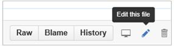

---

title: Docs.microsoft.com contributor guide
description:
keywords:
author: bryanla
manager: 
ms.date: 05/19/2016
ms.topic: article
ms.prod:
ms.service: 
ms.technology:
ms.assetid: 6EFEA410-29E0-400C-A1C2-D93296DDD1DD

---

# Docs.microsoft.com contributor guide

Thank you for your interest in [docs.microsoft.com](https://docs.microsoft.com/), home of the technical content for products and services from Microsoft's Cloud and Enterprise Division!

This is the main page of the Contributor Guide, which is broken into the following sections:

* **[How to contribute](#how-to-contribute)** - covers the various ways you can contribute, not only to the content, but to the larger communities that use services and features covered by docs.microsoft.com content.
* **[Contributing via GitHub pull request](#contributing-via-github-pull-request)** - the pull request mechanism is a primary way in which all content contributions are made. This section provides a brief overview of the process, along with basic definitions of some of the terms we use on docs.microsoft.com. It also contains a summary of the two ways in which you can originate a pull request:
  * Using GitHub's built-in editor to make small contributions, such as corrections.
  * Making changes using a local repository, then pushing them up to GitHub. 
* **[Repository organization](#repository-organization)** - provides an overview of the available docs.microsoft.com repositories to which you can contribute, and the associated directory/file structure and format.
* **[Get started using a local repository](#get-started-using-a-local-repository)** - provides the additional depth you will need to get started in using a local repository for contributions. There is both a QuickStart path for folks with GitHub experience, and a longer more detailed path if you're starting from scratch.

## How to contribute

You can contribute to docs.microsoft.com content and community in a few different ways:
<!--- Using the comments is fine for external contributors, but we want PMs to use github; is that something we message through training alone? ---> 
* **Submit feedback/questions** directly in a [docs.microsoft.com](https://docs.microsoft.com/) article. There are 2 ways of doing this, both of which require you to first sign in to Livefyre ([sign up](https://livefyre.zendesk.com/hc/en-us/articles/200329426-How-do-I-create-a-Livefyre-Account-) with an existing social account, or create a Livefyre account using a designated email address) :
  * General comments can be provided by using the "Comments" feature at the bottom of the article page
  * Context-specific comments can be embedded in the related section/paragraph, by hovering the text and clicking the "sidenote" caption icon
* **Participate in community discussion**, such as a [Microsoft forum][Forum-MSDN-Main] or [Stack Overflow][Forum-SO-Main] discussion. See the [Repository organization](#repository-organization) section below for service-specific examples.
* **Submit a pull request**, which contains your suggested changes to the actual content, targeting content in one of the docs.microsoft.com GitHub repositories. See the [Repository organization](#repository-organization) section below for the list of repositories.

The remainder of this article is devoted to the last option, providing additional detail on how you can use the GitHub Pull Request feature to make contributions. 
## Contributing via GitHub pull request

GitHub is a hosting service for Git repositories, which is where docs.microsoft.com content is stored. A Git *repository* (aka: *repo*) is a conceptual container for one or more branches. A *branch* contains the actual folders/files that make up the set of content for a project. Branches and can also be used for versioning, with the 'master' branch serving as the main plan-of-record for the project.

A *pull request* provides a convenient way to bundle up a series of proposed changes (aka: *commits*) stored in a contributor's source branch, allowing GitHub to first model the changes that would occur if they were *merged* in the target 'master' branch, then eventually merge them. A pull request also serves as a mechanism for you and the pull request reviewer to have a conversation about the changes if necessary, and cover any potential questions or issues before your changes are merged into the target branch. 

There are a couple of different ways of contributing by pull request, depending on the size of changes you would like to propose.

#### Minor contributions: using the GitHub editor

If you're looking for a quick way to make a minor contribution, you can do this directly in the GitHub Web page that corresponds to the article/file in which you would like to propose changes. This requires little/no knowledge of Git versioning workflow, and you can start this process by using either of the following methods :

* Visit the specific article on [https://docs.microsoft.com/](https://docs.microsoft.com/),  then click the **Edit** link in the upper-right corner of the article:
 
     

* Find the article by browsing the Markdown files in the related repository (See the [Repository organization](#repository-organization) section below for the list of repositories).  
 
Both of these will allow you to navigate directly into the GitHub page that serves the article source. Once you are there, click the **Edit this file** pencil icon in the upper right to go into edit mode:

 

From here, you can specify your changes using the GitHub file editor. If you need to create/upload new files, we prefer you follow the instructions in the [Large submissions section](#large-submissions-creating-your-own-local-repository). However, if you really need to, it's also possible to do via the GitHub UI : 

- [Creating files on Github](https://github.com/blog/1327-creating-files-on-github)
- [Upload files to your repositories](https://github.com/blog/2105-upload-files-to-your-repositories)

When you're finished, scroll to the bottom of the page where you can **Propose file change**, which is the default option when you have read access to the repository. Users with read access will then be directed to a working branch in their own fork of the repository (GitHub will automatically create both the fork and branch for you, if either/both do not already exist), and be presented with a "Create pull request" page to create a new entry in the repo's pull request queue. For more information on the entire workflow, see the [Editing files in another user's repository](https://help.github.com/articles/editing-files-in-another-user-s-repository/) GitHub article.

**Note**: the workflow is slightly different when you have write permissions to a repository. For more information, see the [Editing files in your repository](https://help.github.com/articles/editing-files-in-your-repository/) GitHub article.

#### Large submissions: creating your own local repository

If you are making substantial changes to an existing article, adding or changing images, or contributing a new article, you will need to manually create your GitHub fork, then clone the fork down to your local computer. A *fork* is a GitHub-based replica of the main repository, under your GitHub account, which provides you with a working copy which you can use in isolation. It is from your fork that you will create Pull Requests, which will target a docs.microsoft.com repository. Similarly, a *clone* is a local based replica of repository which, in this case, will be a clone of your fork. The clone allows you to work on Git repositories offline, and using more powerful native software/tools.

If you're not already familiar with making Github contributions, you will also need to install a local Git tool such as Git Bash, a Markdown editor, and learn some Git commands. The [Get started using a local repository](#get-started-using-a-local-repository) section will have more details on this. This may seem confusing if you've never used Git or Github, but after a few weeks of usage, it will become second nature.

#### Additional considerations

* If you submit a pull request with new files or significant changes to documentation or code samples, we may also need to correspond with you in the pull request, asking you to submit an online Contribution License Agreement (CLA).
* Minor corrections or clarifications you submit for documentation and code examples in the repository are covered by the [Microsoft Terms of Use (ToU)](https://www.microsoft.com/en-us/legal/intellectualproperty/copyright/default.aspx).
* If you are a Microsoft employee, please always make your contributions via a fork, and use the internal repository that hosts your content. This will ensure your contributions run through the build process, providing validation and affording you a staging environment for evaluating/testing your changes.
*  See the [Resources](#resources) section below for more information on Git concepts such as repositories, forks, branches, pull requests, etc.  

## Repository organization

The content published to docs.microsoft.com is partitioned into several public GitHub repositories. The table below enumerates the current set of docs.microsoft.com landing pages, the GitHub repository that contains the associated articles, and the related discussion forum(s) :

| Main Landing Page | Solution/Service Landing Page | GitHub Org/Repository | Discussion Forum(s) |
|:---------------------------:|:-------------------------------------------:|:-------------------------:|:----------------------------:|
| [Enterprise Mobility][EM-Land-Page] |     | [Microsoft/EMDocs][EM-Land-Repo] | [MSDN][Forum-MSDN-EM] |
|     | [Azure Active Directory][EM-AzureAD-Land] | [Azure/Azure-Content][EM-AzureAD-Repo] | [MSDN][Forum-MSDN-AzureAD], [Stack Overflow][Forum-SO-AzureAD] |
|     | [Multi-Factor Authentication][EM-MFA-Land] | [Azure/Azure-Content][EM-MFA-Repo] | [MSDN][Forum-MSDN-MFA], [Stack Overflow][Forum-SO-MFA] |
|     | [Microsoft Identity Manager][EM-MIM-Land] | [Microsoft/MIMDocs][EM-MIM-Repo] | [MSDN][Forum-MSDN-MIM], [Stack Overflow][Forum-SO-MIM] |
|     | [Microsoft Intune][EM-Intune-Land] | [Microsoft/IntuneDocs][EM-Intune-Repo] | [MSDN][Forum-MSDN-Intune], [Stack Overflow][Forum-SO-Intune] |
|     | [Azure Rights Management][EM-AzureRMS-Land] | [Microsoft/Azure-RMSDocs][EM-AzureRMS-Repo] | [MSDN][Forum-MSDN-AzureRMS], [Stack Overflow][Forum-SO-AzureRMS] |
|     | [Microsoft Advanced Threat Analytics][EM-ATA-Land] | [Microsoft/ATADocs][EM-ATA-Repo] | [MSDN][Forum-MSDN-ATA] |
|     | [Azure RemoteApp][EM-RemoteApp-Land] | [Azure/Azure-Content][EM-RemoteApp-Repo] | [MSDN][Forum-MSDN-RemoteApp], [Stack Overflow][Forum-SO-RemoteApp] |

The content in each repository is loosely aligned with the organization of the articles on the corresponding [https://docs.microsoft.com/](https://docs.microsoft.com/) landing pages. A series of subdirectories are used for separation of usage scenarios/stages (ie: Understand & Explore, Deploy & Use, etc), along with media content (ie: image files) and include files (Markdown files that are reused across multiple main articles).

#### Main articles directory

The main articles directory is found directly off the root of the repository, and contains a set of subdirectories with articles formatted as Markdown files which use an *.md* extension. For example, the main articles directory for the [https://github.com/microsoft/IntuneDocs](https://github.com/microsoft/IntuneDocs) repository is the `/InTuneDocs` subdirectory. 

Within the root of this directory are general articles that relate to the overall service, along with another series of subdirectories, which match the common scenarios as outlined on the main landing page for the service. For instance, the Intune "Understand & Explore" articles are in the `/Understand` subdirectory, "Deploy & Use" articles are found in the `/DeployUse` subdirectory, etc.  

* **Article file names:** Note that file names use the following rules:
    * Contain only lowercase letters, numbers, and hyphens. Windows operating systems are case insensitive, so if you need to rename a file's casing from upper/mixed to lower, you can use the following Git command (use the proper casing as well for both file names) :

            git mv <main-directory/scenario-directory/current-file-name.md> <main-directory/scenario-directory/new-file-name.md>
    * No spaces or punctuation characters. Use the hyphens to separate words and numbers in the file name.
    * No more than 80 characters - this is a publishing system limit
    * Use action verbs that are specific, such as develop, buy, build, troubleshoot. No -ing words.
    * No small words - don't include a, and, the, in, or, etc.
    * Must be in Markdown and use the .md file extension.
* **Media subdirectory:** As mentioned, each article directory also contains a `\media` subdirectory for corresponding media files, inside which are images used by articles that have image references.  
* **Includes subdirectory:** Whenever we have reusable content that is shared across two or more articles, it is placed in an `includes` subdirectory off of the main articles directory. In the Markdown file that wishes to use the include file, a corresponding INCLUDE Markdown extension is placed in the location where the include file needs to be referenced.  

     The format of the extension is as follows:

    `> [!INCLUDE[accessibility6](./includes/accessibility6_md.md)]`

    The statement must begin with `> [!INCLUDE`, followed immediately by a user-defined name for the include site enclosed in brackets, `[accessibility6]`, followed immediately by the relative path to the include file enclosed in parentheses, `(./includes/accessibility6_md.md)`, and terminated with the closing bracket, `]`.

#### Markdown file template

For convenience, the root directory of each repository contains a Markdown template file named `template.md`, which can be used as a "starter file" if you need to create a new article for submission to the repository. The file contains:

- A **metadata header** at the top of the file, delineated by two, 3-hyphen lines, and containing the various tags used for tracking information relating to the article. Article metadata enables certain functionality, such as author attribution, contributor attribution, breadcrumbs, article descriptions, and SEO optimizations as well as reporting processes used by Microsoft to evaluate the performance of the content. So the metadata is important!
- A **"Metadata" section** that describes the various metadata tags and values. If you're unsure of the values to use for the metadata section, you can leave them blank, or comment them with a leading hashtag (#) and they will be reviewed/completed by the pull request reviewer for the repository.
- Various **examples of using Markdown** to format the elements of an artice article.
- General **instructions on the use of Markdown extensions**, which can be used for various types of alerts.
- Examples of **embedding video** using an iframe.
- Eeneral **instructions on the use of docs.microsoft.com extensions**, which can be used for special controls such as buttons and selectors.

## Get started using a local repository

As mentioned earlier, if you are making large contributions or are a Microsoft employee, you need to create your own fork of the respective docs.microsoft.com repository, and clone it to your computer, creating your own local repository. If you're familiar with Git, you may want to just jump to the [Quickstart](#quickstart) section below. If you're unfamiliar with Git, you may want to review some of the resources provided in the [Resources](#resources) section below before beginning, then begin at the [Step-by-step](#step-by-step) section.

#### Quickstart
If you've already configured your GitHub account, installed a client Git tool (such as [Git Bash](https://git-scm.com/downloads)), and created your own fork of the repository you will be contributing to (using the table above), you can use the following general steps to create a pull request that contains your proposed contributions:

1. Clone your forked repository into a local repository

        git clone https://github.com/<account-name>/<docs-repository-name>.git

2. Create a branch for your local work. **Note:** We recommend that you create local working branches that target a specific scope of change. Each branch should be limited to a single concept/article both to streamline work flow and reduce the possibility of merge conflicts.
3. Edit the Markdown files using your favorite Markdown editor.
4. Commit and push your branch/changes back up to your forked repository:
        
        git add -A
        git commit -m "update doc"
        git push origin <branch-name> 
          
5. Return to your GitHub fork and create a pull request, requesting that the commits on your working branch be pulled into the "master" branch of the repository you originally forked.
6. Your content will be automatically published once the pull request is reviewed and merged. Note: you should also create an "upstream" remote to the production Docs repository from which you forked, which will allow you to keep your local repository in sync.

#### Step-by-step

When you're ready to embark on creating a local repository and submitting a pull request, refer to the following articles for detailed guidance on the tools and processes you will need along the way: 

1. First read the [Style and voice article](./ContributorGuide/style-and-voice.md). 
2. Then complete the one-time [Install and setup tools for authoring GitHub content locally](./ContributorGuide/tools-and-setup.md).
3. [Git commands for creating a new article or updating an existing article](./ContributorGuide/git-commands-for-master.md) will guide you in creating your pull request.
4. Read [Retire or rename an article](./ContributorGuide/retire-or-rename-an-article.md) if you think a particular article should be removed from publishing.
5. Microsoft employees should also read [Pull request etiquette and best practices for Microsoft internal contributors](./ContributorGuide/contributor-guide-pull-request-etiquette.md)

## Resources

#### GitHub/Git

* If you're unfamiliar with Git, here are some good resources for ramp-up and familiarization
  * The [GitHub glossary](https://help.github.com/articles/github-glossary) is a good source for basic terminology and definitions. In addition, [this StackOverflow thread](http://stackoverflow.com/questions/7076164/terminology-used-by-git.) contains a glossary of Git terms you'll encounter throughout the Contributor Guide.
  * The [Learn Git course by Codecademy](https://www.codecademy.com/learn/learn-git) provides a 2 hour introduction to Git.
  * Another good beginner course can be found on [Code School](https://www.codeschool.com/courses/try-git). 
  * GitHub also has a great [Resources for learning Git and Github page](https://help.github.com/articles/good-resources-for-learning-git-and-github/), which includes several tutorials/primers, cheat sheets, and video resources.
  * The free [Pro Git e-book](http://git-scm.com/book/en/v2) provides excellent depth if you are new to Git, and also serves as a good reference.
* As mentioned, we recommend and primarily use the Git Bash command-line environment for proposing larger contributions via a personal fork of a repository. When you're ready to install the tools, check out [Software Freedom Conservancy's Git download page](https://git-scm.com/downloads) for the available Git implementations by platform.
* As you become more familiar with Git and GitHub, the following articles may be helpful:
  * [How to undo almost anything with Git (GitHub blog)](https://github.com/blog/2019-how-to-undo-almost-anything-with-git)

#### Markdown
All of the articles in this repository use [GitHub flavored Markdown](https://help.github.com/articles/github-flavored-markdown/). See

- [Markdown basics](https://help.github.com/articles/getting-started-with-writing-and-formatting-on-github/) for a good reference on getting started. 
- [GitHub's full Markdown cheatsheet](https://guides.github.com/pdfs/markdown-cheatsheet-online.pdf) or a [condensed version](./ContributorGuide/media/documents/markdown-cheatsheet.pdf?raw=true), which are printable for a handy syntax reference.
- [Create tables in Markdown](./ContributorGuide/create-tables-markdown.md) for help on table creation. 
- [Create images in Markdown](./ContributorGuide/create-images-markdown.md) for help with using images in Markdown.
- [Linking guidelines](./ContributorGuide/create-links-markdown.md/)
- [Markdown template for technical articles](template.md) for a template to help you get started when proposing new articles.

This is not an exhaustive list, but here are a few ideas for Markdown editors that you may wish to try:

- **Atom**: GitHub's Atom Markdown editor: [http://atom.io](http://atom.io). It does not require a license for business use. It has spell check. 
- **Prose**: This is a lightweight, elegant, on-line, and open source Markdown editor that offers a preview. Visit [http://prose.io](http://prose.io) and authorize Prose in your repository.
- **[Visual Studio Code](https://www.visualstudio.com/products/code-vs.aspx)** - A lightweight but powerful source code editor which runs on your desktop and is available for Windows, OS X and Linux. 
- **Notepad**: You can use Notepad for a very lightweight option.

<!---- Reference links for Docs landing pages, associated GitHub repositories, and related Forums matrix. ------------------>
<!---- PLEASE INSERT URLS IN ASCENDING SORT ORDER, AND REMOVE LOCALE SEGMENT FROM URLS (ie: en-us) FOR LOCALIZED FORUMS! -->
[EM-ATA-Land]: https://docs.microsoft.com/advanced-threat-analytics/
[EM-ATA-Repo]: https://github.com/Microsoft/ATADocs
[EM-AzureAD-Land]: https://docs.microsoft.com/active-directory/
[EM-AzureAD-Repo]: https://github.com/Azure/azure-content/tree/master/articles/active-directory/
[EM-AzureRMS-Land]: https://docs.microsoft.com/rights-management/
[EM-AzureRMS-Repo]: https://github.com/Microsoft/Azure-RMSDocs
[EM-Intune-Land]: https://docs.microsoft.com/intune/
[EM-Intune-Repo]: https://github.com/microsoft/intuneDocs
[EM-Land-Page]: https://docs.microsoft.com/enterprise-mobility/
[EM-Land-Repo]: https://github.com/Microsoft/EMDocs/
[EM-MFA-Land]: https://docs.microsoft.com/multi-factor-authentication/
[EM-MFA-Repo]: https://github.com/Azure/azure-content/tree/master/articles/multi-factor-authentication
[EM-MIM-Land]: https://docs.microsoft.com/microsoft-identity-manager/
[EM-MIM-Repo]: https://github.com/Microsoft/MIMDocs
[EM-RemoteApp-Land]: https://docs.microsoft.com/en-us/remoteapp/
[EM-RemoteApp-Repo]: https://github.com/Azure/azure-content/tree/master/articles/remoteapp

[Forum-MSDN-ATA]: https://social.technet.microsoft.com/Forums/en-US/home?forum=mata
[Forum-MSDN-AzureAD]: https://social.msdn.microsoft.com/Forums/en-US/home?forum=WindowsAzureAD
[Forum-MSDN-AzureRMS]: https://social.technet.microsoft.com/Forums/en-US/home?forum=rmscloud
[Forum-MSDN-EM]: https://social.technet.microsoft.com/Forums/en-US/home?sort=relevancedesc&brandIgnore=True&searchTerm=Enterprise+Mobility
[Forum-MSDN-Intune]: https://social.technet.microsoft.com/Forums/en-us/home?category=microsoftintune
[Forum-MSDN-Main]: https://social.technet.microsoft.com/Forums/home
[Forum-MSDN-MFA]: https://social.msdn.microsoft.com/Forums/en-US/home?forum=windowsazureactiveauthentication
[Forum-MSDN-MIM]: https://social.technet.microsoft.com/Forums/en-US/home?category=identitymanagement
[Forum-MSDN-RemoteApp]: https://social.technet.microsoft.com/Forums/en-US/home?filter=alltypes&brandIgnore=True&sort=relevancedesc&searchTerm=Azure+Remote+or+RemoteApp
[Forum-SO-AzureAD]: http://stackoverflow.com/questions/tagged/azure-active-directory
[Forum-SO-AzureRMS]: http://stackoverflow.com/questions/tagged/rights-management
[Forum-SO-Main]: http://stackoverflow.com/tags
[Forum-SO-Intune]: http://stackoverflow.com/questions/tagged/intune
[Forum-SO-MFA]: http://stackoverflow.com/search?q=%5Bazure%5D+multi-factor
[Forum-SO-MIM]: http://stackoverflow.com/search?q=Microsoft+Identity+Manager
[Forum-SO-RemoteApp]: http://stackoverflow.com/questions/tagged/remoteapp

